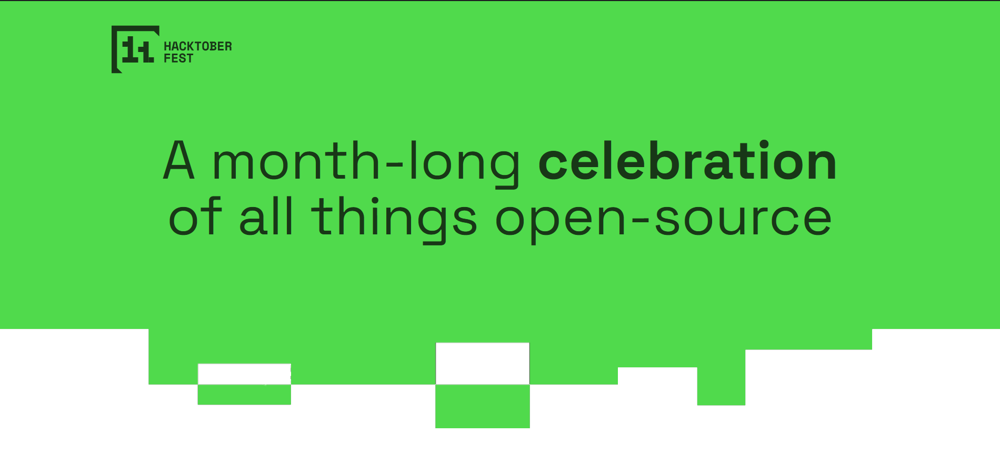

<h1 style="color:#50da4c; font-size:4rem;" align="center"> 
HackWithZairza
</h1>

The Flagship Technical Society of OUTR - Zairza presents to you HackWithZairza.    A month long Open Source Extravaganza. 
We are thrilled to have you join us for this exciting celebration of open-source contributions, innovation, and collaboration.       
Hacktoberfest is an annual global event that encourages people from all backgrounds to participate in open-source projects, make meaningful contributions, and grow their skills.      
Whether you're a seasoned developer or just starting your coding journey, this is the perfect opportunity to collaborate, learn, and build together. Let's embrace the spirit of open source, contribute to impactful projects, and create something amazing.     
Happy Hacking!

